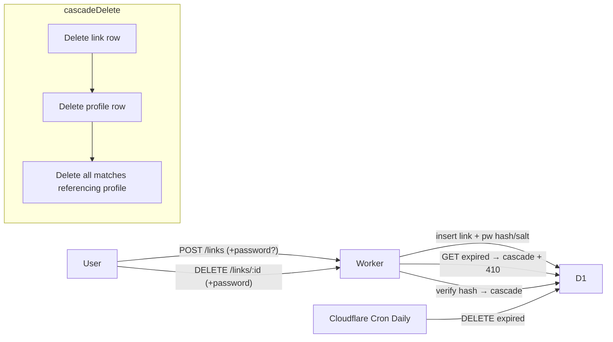

# PLAN-TASK7 — 링크 3일 만료 & 내 링크 관리

> 링크 TTL을 3일로 줄이고, 만료/수동 삭제 시 프로필·매칭까지 cascade 삭제. 사용자가 생성 시 선택 비밀번호를 설정하면 홈의 설정 패널에서 내 링크를 직접 삭제 가능. 비번 미설정 시 수동 삭제 불가를 UI에서 안내.

## 결정 정리

- **Cascade**: 링크 삭제(수동/자동) 시 해당 `profile` + 그 profile이 등장하는 모든 `matches`까지 함께 삭제.
- **Password**: 선택 입력. 비번 없으면 수동 삭제 불가이며 UI에서 명확히 안내(3일 뒤 자동 삭제 예정).

---

## 아키텍처 개요

---

## 백엔드 작업

### 1. 스키마 마이그레이션 — `packages/worker/migrations/0002_link_lifecycle.sql` (신규)
- `ALTER TABLE links ADD COLUMN password_hash TEXT` / `password_salt TEXT`
- `CREATE INDEX IF NOT EXISTS idx_links_expires_at ON links(expires_at)` (cron sweep용)

### 2. 비밀번호 유틸 — `packages/worker/src/services/password.ts` (신규)
- Workers Web Crypto(`crypto.subtle`) 기반 PBKDF2(SHA-256, 100k iter)
- `hashPassword(pw)` → `{ hash, salt }` (base64)
- `verifyPassword(pw, hash, salt)` → 상수시간 비교

### 3. Cascade 삭제 공용 서비스 — `packages/worker/src/services/cleanup.ts` (신규)
- `deleteLinkCascade(db, linkId)`:
  - `profile_id` 조회 → `DELETE FROM matches WHERE profile_a_id = ? OR profile_b_id = ?` → `DELETE FROM profiles WHERE profile_id = ?` → `DELETE FROM links WHERE link_id = ?`
  - `db.batch([...])` 로 원자적 실행
- `sweepExpiredLinks(db)`:
  - `SELECT link_id FROM links WHERE expires_at < ?` 후 각각 cascade 호출

### 4. 라우트 수정 — `packages/worker/src/routes/links.ts`
- `POST /`:
  - TTL `30일 → 3일`
  - 바디에 `password?: string` 허용. 있으면 `hashPassword` 실행해 `password_hash/salt` 저장
- `GET /:linkId`:
  - 만료 확인 시 `deleteLinkCascade` 호출 후 `410 gone`
- `DELETE /:linkId` (신규):
  - 링크 조회 → `password_hash`가 NULL이면 `409 { error: 'password_not_set' }`
  - `verifyPassword` 실패 시 `403`
  - 성공 시 `deleteLinkCascade` → `204`

### 5. 예약 작업 — `packages/worker/src/index.ts` + `packages/worker/wrangler.toml`
- `export default { fetch: app.fetch, scheduled }` 형태로 전환
- `scheduled(_, env, ctx)`에서 `ctx.waitUntil(sweepExpiredLinks(env.DB))`
- `wrangler.toml`에 `[triggers] crons = ["0 3 * * *"]` 추가 (UTC 매일 03:00)

### 6. 타입 정비 — `packages/worker/src/types/api.ts`
- `CreateLinkRequest`에 `password?: string` 추가
- `LinkRow`에 `password_hash: string | null; password_salt: string | null`

---

## 프론트엔드 작업

### 7. API 클라이언트 — `packages/frontend/src/api/client.ts`
- `postLink(profileId, password?)` 비번 전달
- `deleteLink(linkId, password)` 신규 (DELETE + body)

### 8. 로컬 스토리지 유틸 — `packages/frontend/src/lib/myLinks.ts` (신규)
- 키: `ebm:my-links`
- 엔트리: `{ link_id, profile_id, nickname, created_at, expires_at, has_password }`
- API: `listMyLinks / saveMyLink / removeMyLink / pruneExpired`
- 민감 정보(비번 평문)는 저장하지 않음 — 삭제 시점에 사용자가 다시 입력

### 9. FormPage 비번 입력 — `packages/frontend/src/pages/FormPage/index.tsx`
- 하단 CTA 패널에 선택 입력 필드 추가:
  - "삭제 비밀번호 (선택)" + 보조 문구 "미입력 시 수동 삭제 불가. 3일 뒤 자동 삭제됩니다."
- submit 시 `postLink(profileId, password || undefined)` 호출
- 성공 후 `saveMyLink({ ..., has_password: !!password })`

### 10. SharePage 만료 안내 — `packages/frontend/src/pages/SharePage.tsx`
- 생성 후 돌아온 `expires_at` 기반으로 "YYYY.MM.DD HH:mm 만료 (3일 뒤)" 배지 표시
- 비번 없을 때 경고 박스: "수동 삭제가 불가합니다. 만료 전까지 링크가 노출됩니다."

### 11. 홈 설정 패널 — `packages/frontend/src/pages/HomePage.tsx` + `MyLinksPanel.tsx` (신규)
- 우상단 톱니바퀴(cog) 아이콘 버튼 → 모달/드로어로 `MyLinksPanel` 오픈
- 마운트 시 `pruneExpired()` 실행
- 각 엔트리:
  - `nickname · 만료 D-n · 생성일`
  - 버튼 "삭제":
    - `has_password === false`: toast "비밀번호가 설정되지 않아 수동 삭제 불가. 3일 뒤 자동 삭제됩니다." + 보조 버튼 "로컬 기록에서만 제거"
    - `has_password === true`: 인라인 비번 입력 → `deleteLink(id, pw)`
      - 403(비번 불일치) → 인라인 에러
      - 204 → 로컬 기록에서 제거 + toast "삭제되었습니다 (프로필·매칭 포함)"
  - 만료 링크로 표시되는 경우 ("만료됨") 삭제 버튼 대신 "기록에서 제거"만 노출

### 12. 만료 링크 UX — Share/Result/Match 경로 410 처리
- 기존 에러 토스트는 존재. 문구 고정: "만료되었거나 삭제된 링크입니다."
- 관련 파일: `packages/frontend/src/pages/MatchInputPage.tsx`, `packages/frontend/src/api/client.ts`의 에러 메시지 매핑 (필요 시 status → 문구 헬퍼)

### 13. 타입 — `packages/frontend/src/types/api.ts`
- `CreateLinkRequest`에 `password?: string` 추가

---

## 리스크 & 주의사항

- **기존 데이터**: 마이그레이션 후 `password_hash IS NULL`인 기존 링크는 자동으로 "수동 삭제 불가" 취급. 프로덕션 D1에도 동일 마이그레이션 적용 필요.
- **TTL 단축**: 이미 생성된 `expires_at = +30일` 링크는 그대로 유지됨(사용자 혼선 방지). 새 링크부터 3일 적용. 필요하면 일회성 SQL로 clamp 가능(사용자가 원할 때만).
- **Cron 타이밍**: 매일 1회. 만료 직후에도 최대 24h까지 DB에 남아 있을 수 있지만, lazy delete가 `GET /:linkId`에서 동작하므로 접근 시 즉시 정리됨.
- **중복 매칭 삭제**: profile 하나가 여러 match에 등장할 수 있으므로 `WHERE profile_a_id = ? OR profile_b_id = ?`로 일괄.
- **localStorage 한계**: 브라우저를 바꾸면 "내 링크" 목록이 사라짐 → 사용자에게 초기 안내 문구로 공지.
- **비번 저장 범위**: 평문/해시 모두 로컬 저장 금지. 서버 측 PBKDF2 해시만.

---

## Todos

- [ ] **db_migration**: 0002 마이그레이션 작성: `links.password_hash/salt` 추가 + `expires_at` 인덱스
- [ ] **password_util**: `services/password.ts` 신규 — PBKDF2 해시/검증 (Web Crypto)
- [ ] **cleanup_service**: `services/cleanup.ts` 신규 — `deleteLinkCascade`, `sweepExpiredLinks` (배치)
- [ ] **links_route**: `links` 라우트 — TTL 3일, POST 비번 저장, GET 지연 삭제, DELETE `/:id` 신규
- [ ] **scheduled**: Worker `scheduled` 핸들러 + `wrangler.toml` cron 트리거
- [ ] **worker_types**: Worker `types/api.ts` — `CreateLinkRequest.password`, `LinkRow` 확장
- [ ] **api_client**: 프론트 API 클라이언트 — `postLink(password)`, `deleteLink` 추가
- [ ] **my_links_util**: `lib/myLinks.ts` 신규 — localStorage CRUD + `pruneExpired`
- [ ] **form_password_field**: FormPage 하단에 선택 비번 필드 + submit 연동 + 로컬 저장
- [ ] **share_expiry_ui**: SharePage 만료 배지 안내 + 비번 미설정 경고
- [ ] **home_my_links_panel**: HomePage 톱니바퀴 + MyLinksPanel 모달 (삭제 흐름, 잔여 일수)
- [ ] **expired_ux_copy**: 410 응답에 대한 사용자 문구 고정
- [ ] **frontend_types**: 프론트 `types/api.ts` — `CreateLinkRequest.password`
- [ ] **verify**: `tsc` 통과 확인, 로컬에서 수동 워크플로우 테스트(링크 생성→삭제/만료)
